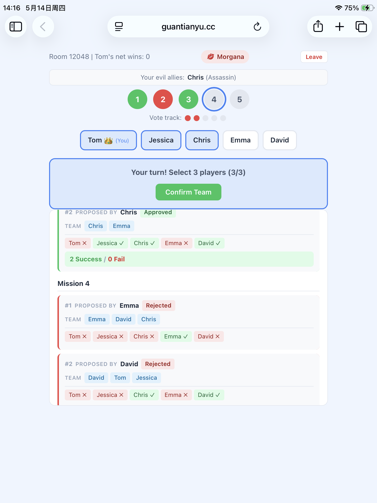

# Guan Yu Board Games

A real-time multiplayer board game platform where players join rooms and play together via WebSocket. Supports **Avalon** (social deduction, 5-10 players) and **BlackJack** (1-7 players).

**Live Demo:** [guantianyu.cc](https://guantianyu.cc)



## Why I Built This

My friends and I play Avalon regularly, but dealing cards and tracking votes on paper is tedious. I needed a portfolio project to demonstrate my C# skills for job hunting in New Zealand — so I combined both needs and built a digital board game platform we actually use.

## Tech Stack

**Backend:** C# / ASP.NET Core 8 / SignalR / Entity Framework Core / PostgreSQL / JWT Auth

**Frontend:** React / Vite

**DevOps:** Docker (multi-stage build) / Docker Compose / AWS EC2 / Cloudflare (DNS + SSL)

**Testing:** xUnit (197 test cases covering game logic, auth, controllers, and DTOs)

## Technical Challenges & Solutions

### Real-time State Synchronization
Players need to see game updates instantly. I used **SignalR WebSockets** for bidirectional communication — the server pushes per-player game state (each player sees different information based on their role) to all connected clients after every action.

### Complex Game State Machine
Avalon has 6 phases (NightReveal -> TeamProposal -> TeamVote -> Mission -> Assassination -> GameOver), each with different valid actions and transitions. I modeled this as a **state machine in the domain layer** with strict validation — the frontend is a thin rendering layer, all game logic lives server-side to prevent cheating.

### Disconnection & Reconnection
Players frequently close browsers or lose connection mid-game. I implemented a **reconnection system** that:
- Tracks disconnected players with a grace period
- Restores full game state (including vote/mission progress) on rejoin
- Handles race conditions when a player refreshes (old connection still active)
- Detects active rooms on login and offers rejoin instead of creating new rooms

### Role-based Information Asymmetry
In Avalon, different roles see different information (e.g., Merlin sees evil players, Percival sees Merlin and Morgana, evil players see each other except Oberon). The server generates **per-player DTOs** — each client only receives the information their role is allowed to see. This prevents any client-side cheating.

### Concurrent Player Actions
Multiple players vote or play mission cards simultaneously. The backend uses thread-safe state management to handle concurrent SignalR calls, resolving actions only when all expected inputs arrive (e.g., all votes collected -> resolve proposal, all mission cards played -> resolve mission).

## Project Structure

```
BoardGames/              # ASP.NET Core backend (Hubs, Models, Services, Data)
BoardGames.Web/          # React frontend (Vite)
BoardGames.Tests/        # xUnit unit tests
Dockerfile               # Multi-stage build: Node 20 (frontend) -> .NET 8 (backend) -> runtime
docker-compose.yml       # App + PostgreSQL containers
```

## How to Run

```bash
# With Docker (recommended)
docker-compose up -d
# App available at http://localhost:80

# Or manually
cd BoardGames.Web && npm install && npm run build
cd ../BoardGames && dotnet run

# Run tests
dotnet test
```
